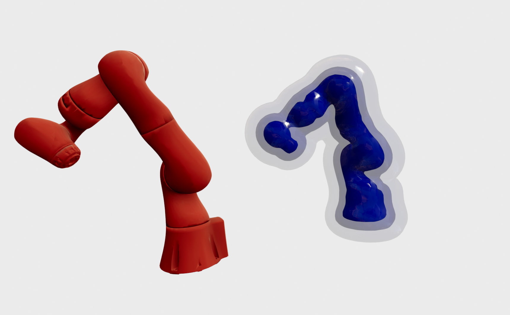
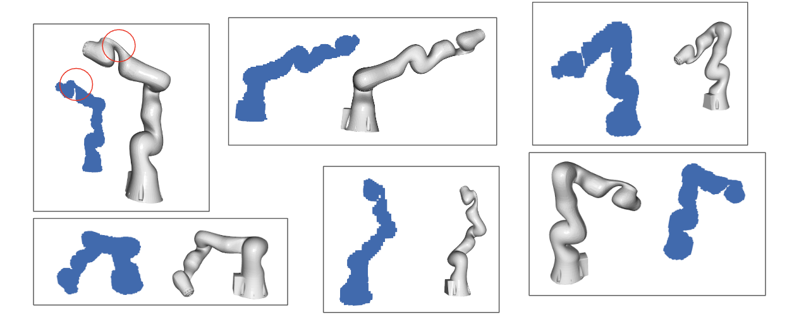

## Learning **hierarchical features** for **fine-grained** robot geometry and forward kinematic chain. 

#### Visualized Distance Function at value 0, 4 cm and 10 cm





#### Predicted Voxel Grid




### Requirement

This repo is tested under following envrionment:

- torch == 1.12.0
- numpy == 1.23.1
- trimesh == 3.22.1
- open3d == 0.16.0
- omegaconf == 2.2.3
- urdfpy == 0.0.22
- python == 3.9


### Usage

Please refer to

```shell
python tutorial.py
```

